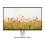

# Unwallpaper

Download awesome photos from Unsplash as wallpaper.

Features:

* Browse and download photos from Unsplash
* Set wallpaper by one click
* Support KDE, GNOME and Windows platform
* Simple Chinese translation

[More screenshots...](http://imgur.com/a/LmE5x)

## Download & Install

### openSUSE/Fedora/Debian/Ubuntu

[Install official RPM or DEB packages](https://software.opensuse.org//download.html?project=home%3Aguoyunhebrave&package=unwallpaper)

### Windows & Other GNU/Linux Distributions

[Download](https://github.com/guoyunhe/unwallpaper/releases)

## Build

### Linux

* Qt Creator
* Qt >= 5.7.0
* Magick++

### Windows

* Qt (MinGW) >= 5.7.0
* Win32-OpenSSL 1.0.x (NOTE: 1.1.x or newer won't work with Qt)
* NSIS (if you want to create a single file Windows installer)

Build as normal Qt project. It will generate a `unwallpaper.exe`. Move it to `win` folder in project root.

Copy following DLL files from `C:\Qt\Qt5.8\MinGW\bin` (your installation path may be different) to `win`:

* libgcc_s_dw2-1.dll
* libstdc++-6.dll
* libwinpthread-1.dll
* libEGL.dll
* libGLESv2.dll
* Qt5Core.dll
* Qt5Gui.dll
* Qt5Network.dll
* Qt5Qml.dll
* Qt5Quick.dll
* Qt5Svg.dll
* Qt5Widgets.dll

Copy following DLL files form `C:\Win32-OpenSSL\bin` (your installation path may be different) to `win`:

* libeay32.dll
* ssleay32.dll

That's all you have to do on Windows. Next steps you can do on Linux.

Compile translations with `lrelease unwallpaper.pro` command. Copy `translations` folder to `win`.

Switch to `win` folder. Use `makensis unwallpaper.nsi` to create a single executable installer. It
is named as `unwallpaper-0.1.0-installer.exe`.

## Copyright

Guo Yunhe 2017.

Under GNU General Public License version 3.

Use Qt for graphical user interface. Use Magick++ library to process images.

[The photo](https://unsplash.com/photos/IicyiaPYGGI) in icon is made by photographer
[Henry Be](https://unsplash.com/@henry_be), licensed under Creative Commons Zero.

The monitor in icon is created by [Facebook](http://facebook.design/devices).
